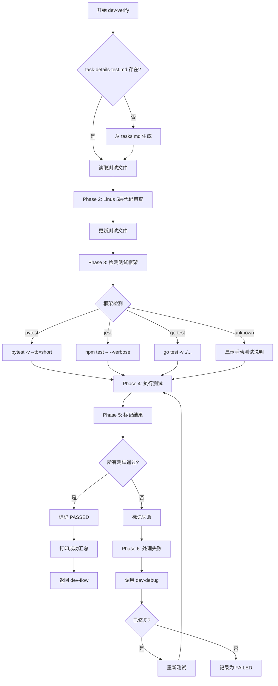

# dev-verify Skill

> **Talk is cheap. Show me the test results.** - Linus Torvalds (modified)

## 概述

**dev-verify** 是 dev-flow 生态系统的测试验证执行器，填补了测试规划（dev-flow）和问题解决（dev-debug）之间的空白。

**核心能力**：
1. ✅ 真实执行测试（通过 Bash 工具，非 AI 模拟）
2. 📊 应用 Linus Torvalds 5层代码审查
3. 📝 在 `task-details-test.md` 中标记测试结果
4. 🔧 失败自动调用 `dev-debug` 技能

---

## 触发条件

### 🔴 强信号（立即激活）

- **dev-flow 集成**：进入 dev-flow Step 4 测试验证阶段（自动调用）
- **明确请求**："验证测试"、"运行测试"、"执行测试"、"dev-verify"
- **测试命令**："测试是否通过"、"运行所有测试"、"test all"

### 🟡 中等信号（确认后激活）

- "测试一下"、"看看有没有问题"、"检查测试"

### 🟢 弱信号（不激活）

- "如何测试"、"什么是pytest"、"测试框架怎么用"（咨询性问题）

---

## 工作流程（6阶段）



---

## Phase 1: 文件检查

### 1.1 检查 `task-details-test.md` 是否存在

```bash
if [ ! -f "task-details-test.md" ]; then
    echo "📝 task-details-test.md 不存在，正在从 tasks.md 生成..."
    # 从 tasks.md 读取当前任务，生成测试方案
fi
```

### 1.2 读取当前任务

从 `tasks.md` 提取当前正在执行的任务：

```markdown
## tasks.md 示例

### TODO
- [ ] 实现用户登录API ← 当前任务

### IN PROGRESS
- [x] 设计数据库schema

### DONE
- [x] 初始化项目
```

### 1.3 生成 `task-details-test.md`

使用 dev-flow 的测试方案模板（5个测试类别）：
1. 单元测试
2. 集成/功能测试
3. 启动和运行测试
4. 行为验证测试
5. 性能/回归测试

---

## Phase 2: 代码审查（Linus 5层分析）

在运行测试**之前**，应用 Linus Torvalds 风格的代码审查。

### 2.1 5层分析框架

从 `dev-review` 技能继承的审查维度：

```markdown
## 📊 代码审查（运行前）

基于 Linus Torvalds 5层框架：

### Layer 1: 数据结构分析
- **核心数据模型**: [识别主要数据结构]
- **数据流向**: [追踪数据如何流动]
- **潜在问题**: [标记数据结构问题]

### Layer 2: 特殊情况识别
- **边界条件**: [列举需要测试的边界]
- **错误处理**: [检查异常处理路径]

### Layer 3: 复杂度审查
- **嵌套深度**: [计算嵌套层次，>3 需要标记]
- **抽象层次**: [评估抽象是否合理]

### Layer 4: 破坏性分析
- **API兼容性**: [验证是否有破坏性变更]
- **行为变更**: [检查是否改变现有行为]

### Layer 5: 实用性验证
- **真实问题**: [确认是否解决实际问题]
- **过度工程**: [评估是否过度设计]

**审查评分**: [X/10]
**建议改进**:
- [ ] P0 - 必须修复：[列表]
- [ ] P1 - 强烈建议：[列表]
```

### 2.2 更新 `task-details-test.md`

将审查结果添加到测试文件开头。

---

## Phase 3: 测试框架检测

自动检测项目使用的测试框架。

### 3.1 检测逻辑

**Python (pytest)**:
```bash
if [ -f "pytest.ini" ] || [ -f "pyproject.toml" ] || [ -f "setup.py" ]; then
    echo "pytest"
elif [ -f "requirements.txt" ] && grep -q "pytest" requirements.txt; then
    echo "pytest"
elif find . -name "test_*.py" -o -name "*_test.py" | grep -q .; then
    echo "pytest"
fi
```

**JavaScript/TypeScript**:
```bash
if [ -f "package.json" ]; then
    if grep -q '"jest"' package.json; then
        echo "jest"
    elif grep -q '"vitest"' package.json; then
        echo "vitest"
    elif grep -q '"mocha"' package.json; then
        echo "mocha"
    elif grep -q '"test"' package.json; then
        echo "npm-test"
    fi
fi
```

**Go**:
```bash
if find . -name "*_test.go" | grep -q .; then
    echo "go-test"
fi
```

**Java**:
```bash
if find . -name "*Test.java" | grep -q .; then
    if [ -f "pom.xml" ]; then
        echo "mvn-test"
    elif [ -f "build.gradle" ] || [ -f "build.gradle.kts" ]; then
        echo "gradle-test"
    else
        echo "junit"
    fi
fi
```

### 3.2 未知框架处理

如果无法检测框架：
```markdown
⚠️  未检测到测试框架

请手动验证：
1. 启动应用: [command]
2. 测试功能: [steps]
3. 提供测试结果

或在项目根目录添加配置文件：
- Python: pytest.ini, setup.py, pyproject.toml
- JavaScript: package.json with test script
- Go: *_test.go files
- Java: pom.xml or build.gradle
```

---

## Phase 4: 执行测试（真实执行）

### 4.1 测试框架命令映射

| 框架 | 命令 | 输出格式 |
|------|------|----------|
| pytest | `pytest -v --tb=short` | `=== X passed, Y failed in N.NNs ===` |
| jest | `npm test -- --verbose` | `Tests: X passed, Y failed, Z total` |
| vitest | `npm test -- --run` | `Tests: X passed, Y failed` |
| mocha | `npm test` | `passing: X, failing: Y` |
| go-test | `go test -v ./...` | `PASS`, `FAIL` |
| mvn-test | `mvn test` | `Tests run: X, Failures: Y` |
| gradle-test | `gradle test` | `X tests completed, Y failed` |
| junit | `java org.junit.runner.JUnitCore` | `OK (X test(s))` |

### 4.2 通过 Bash 工具执行

**关键**：使用 Bash 工具执行，**不是 AI 模拟**。

```python
# 示例逻辑
framework = detect_test_framework()

command = {
    "pytest": "pytest -v --tb=short",
    "jest": "npm test -- --verbose",
    "vitest": "npm test -- --run",
    "go-test": "go test -v ./...",
    "mvn-test": "mvn test",
    "gradle-test": "gradle test",
}[framework]

# 执行
result = Bash(command, timeout=300)  # 5 分钟超时
```

### 4.3 超时和错误处理

```python
if result.exit_code == 124:  # timeout
    mark_test_result("TIMEOUT", "测试超过 5 分钟超时")
    suggest_timeout_increase()

if result.exit_code != 0:
    parse_test_failure(result.stdout, result.stderr)
```

---

## Phase 5: 标记结果

### 5.1 解析测试输出

**pytest 示例**：
```
tests/test_auth.py::test_login PASSED
tests/test_auth.py::test_register PASSED
tests/test_api.py::test_get_user FAILED

========== 15 passed, 1 failed in 2.34s ==========
```

解析：
- `passed`: 15
- `failed`: 1
- `time`: 2.34s

### 5.2 更新 `task-details-test.md`

```markdown
## 1. 单元测试

**状态**: ✅ PASSED (15/15)
**执行时间**: 2025-02-05 14:35:22
**框架**: pytest
**命令**: `pytest -v --tb=short`
**输出**:
```
tests/test_auth.py::test_login PASSED
tests/test_auth.py::test_register PASSED
tests/test_api.py::test_get_user PASSED
...
========== 15 passed in 2.34s ==========
```

- [x] 核心函数的输入输出
- [x] 边界条件和异常处理
- [x] 状态变化逻辑
```

### 5.3 失败标记格式

```markdown
## 2. 集成/功能测试

**状态**: ❌ FAILED (5/8 passed, 3 failed)
**执行时间**: 2025-02-05 14:36:10

### 失败详情

**失败 #1**: test_login_api
- **错误**: `AssertionError: Expected status 200, got 500`
- **文件**: `tests/integration/test_auth.py:45`
- **堆栈**:
```
File "tests/integration/test_auth.py", line 45, in test_login_api
    assert response.status_code == 200
AssertionError: Expected 200, got 500

Internal Server Error: Database connection timeout
```
```

---

## Phase 6: 处理失败（自动调用 dev-debug）

### 6.1 提取错误上下文

```python
error_context = {
    "test_name": "test_login_api",
    "error_message": "AssertionError: Expected 200, got 500",
    "stack_trace": "File \"tests/integration/test_auth.py\"...",
    "file": "tests/integration/test_auth.py",
    "line": 45,
    "timestamp": "2025-02-05 14:36:10"
}
```

### 6.2 调用 dev-debug

对于每个失败的测试：

```python
# 调用 dev-debug 技能
Skill("dev-debug", args=error_context)

# dev-debug 会：
# 1. 使用 5 Whys 或第一性原理分析根因
# 2. 提供解决方案
# 3. 修复代码
```

### 6.3 重新测试

```python
# 修复后，重新运行特定测试
retest_result = Bash(f"pytest tests/integration/test_auth.py::test_login_api -v")

if retest_result.exit_code == 0:
    mark_as_fixed("test_login_api")
else:
    mark_as_failed_with_debug_notes("test_login_api")
```

### 6.4 记录 Debug 会话

在 `task-details-test.md` 中记录：

```markdown
### 🔧 Debug Session #1

**时间**: 2025-02-05 14:36:15
**触发**: test_login_api 失败

**dev-debug 分析**:
- **方法**: 5 Whys 根因分析
- **根因**: Database connection not closed in finally block
- **修复**: Added `connection.close()` in `api/auth.py:67`

**验证**: ✅ PASSED (重新测试)
```

---

## 测试结果汇总

在 `task-details-test.md` 末尾添加汇总表：

```markdown
## 📋 测试汇总

**最后更新**: 2025-02-05 14:40:00

| 测试类别 | 状态 | 通过/总计 | 执行时间 |
|---------|------|----------|---------|
| 1. 单元测试 | ✅ | 15/15 | 2.3s |
| 2. 集成测试 | ✅ | 8/8 | 10.5s (含修复) |
| 3. 启动测试 | ✅ | 通过 | 5.2s |
| 4. 行为测试 | ✅ | 通过 | 3.1s |
| 5. 性能测试 | ⏭️ | 跳过 | - |

**总体结果**: ✅ 所有测试通过

---

## ✅ 验收标准

- [x] 所有核心测试通过
- [x] 无 P0 级别代码问题
- [x] 性能指标达标
- [x] 所有 Debug 会话已关闭
```

---

## 与 dev-flow 集成

### v7.0 架构下的角色

在新的 subagent 架构中，dev-verify 被 **dev-flow (Task Executor)** 在 Step 2 测试阶段调用：

```
dev-loop (orchestrator)
  ↓ 调度
dev-flow (task executor)
  ├── Step 2: 实现 + 测试
  │   └── 调用 dev-verify ← 你在这里
  └── Step 3: Debug 循环
      └── 调用 dev-debug
```

### dev-flow Step 2 集成

**调用时机**：dev-flow 完成子任务实现后，自动调用 dev-verify

**dev-verify 将自动**：
1. 应用 Linus 5层代码审查
2. 检测测试框架
3. 执行真实测试（非 AI 模拟）
4. 标记测试结果到 task-details-test.md
5. 返回测试结果给 dev-flow

**关键变化（v7.0）**：
- dev-verify **不再直接调用 dev-debug**
- 测试失败时，dev-verify 返回失败信息给 dev-flow
- **dev-flow 负责调用 dev-debug**（因为 dev-flow 管理 debug 重试计数和 ROLLBACK 逻辑）

**场景 A：所有测试通过**
```
AI: "✅ dev-verify 报告：所有测试通过

     测试结果汇总：
     ✅ 单元测试：15/15 通过
     ✅ 集成测试：8/8 通过
     ✅ 启动测试：通过
     ✅ 代码审查评分：8/10

     返回 PASSED 给 dev-flow"
```

**场景 B：部分测试失败**
```
AI: "❌ dev-verify 报告：部分测试失败

     失败详情：
     ❌ 集成测试：5/8 通过 (3失败)
        - test_login_api: 500错误
        - test_database_connection: 超时
        - test_user_registration: 断言失败

     返回 FAILED + 错误详情给 dev-flow
     （由 dev-flow 决定是否调用 dev-debug）"
```

**⚠️ 严禁行为**：
- ❌ AI 模拟测试结果（必须真实执行）
- ❌ 跳过失败测试（必须报告所有失败）
- ❌ 直接调用 dev-debug（v7.0 中由 dev-flow 管理 debug 循环）
- ✅ 准确报告测试结果给 dev-flow

---

## 支持的测试框架

### v0.1.0 初始支持

| 语言 | 框架 | 检测依据 | 命令 |
|------|------|----------|------|
| Python | pytest | pytest.ini, pyproject.toml, requirements.txt | `pytest -v --tb=short` |
| JS/TS | jest | package.json: "jest" | `npm test -- --verbose` |
| JS/TS | vitest | package.json: "vitest" | `npm test -- --run` |
| JS/TS | mocha | package.json: "mocha" | `npm test` |
| Go | go test | *_test.go files | `go test -v ./...` |
| Java | JUnit + Maven | *Test.java + pom.xml | `mvn test` |
| Java | JUnit + Gradle | *Test.java + build.gradle | `gradle test` |

### 后续版本

- Ruby (RSpec)
- .NET (NUnit, xUnit)
- PHP (PHPUnit)
- Rust (cargo test)

---

## 错误处理

### 场景 1: 无测试框架

```markdown
⚠️  未检测到测试框架

**建议**：
1. 创建测试文件
2. 或跳过自动测试，手动验证功能
3. 更新 task-details-test.md 标记为手动测试
```

### 场景 2: 测试超时

```markdown
⏱️  测试超时（超过 5 分钟）

**可能原因**：
- 测试陷入死循环
- 等待外部服务响应
- 数据库连接问题

**建议**：
1. 检查测试日志
2. 增加超时时间
3. 跳过慢速测试
```

### 场景 3: 依赖缺失

```markdown
❌ 测试依赖缺失

**错误**：`ModuleNotFoundError: No module named 'pytest'`

**建议**：
```bash
# Python
pip install pytest

# JavaScript
npm install

# Go
go mod download

# Java
mvn dependency:resolve
```
```

---

## 日志格式

所有操作记录到 `dev-verify.log`：

```markdown
[2025-02-05 14:35:10] [START] dev-verify 开始
  → 测试文件: task-details-test.md
  → 任务: 实现用户认证系统

[2025-02-05 14:35:12] [REVIEW] Linus 5层代码审查
  → 评分: 8/10
  → P0问题: 0个
  → P1问题: 2个

[2025-02-05 14:35:15] [DETECT] 测试框架检测
  → 框架: pytest
  → 依据: pytest.ini exists

[2025-02-05 14:35:16] [EXECUTE] 单元测试执行
  → 命令: pytest -v --tb=short
  → 结果: 15 passed in 2.34s

[2025-02-05 14:35:20] [EXECUTE] 集成测试执行
  → 命令: pytest tests/integration/
  → 结果: 5 passed, 3 failed

[2025-02-05 14:35:22] [FAILURE] 测试失败 #1
  → 测试: test_login_api
  → 错误: AssertionError: Expected 200, got 500
  → 文件: tests/integration/test_auth.py:45

[2025-02-05 14:35:23] [INVOKE] 调用 dev-debug
  → 失败: test_login_api
  → 方法: 5 Whys

[2025-02-05 14:35:45] [FIXED] dev-debug 完成
  → 根因: Database connection not closed
  → 修复: Added finally block
  → 文件: api/auth.py:67

[2025-02-05 14:35:50] [RETEST] 重新测试
  → 命令: pytest tests/integration/test_auth.py::test_login_api
  → 结果: PASSED

[2025-02-05 14:36:00] [SUMMARY] 测试汇总
  → 单元测试: 15/15 ✅
  → 集成测试: 8/8 ✅ (3修复)
  → 启动测试: ✅
  → 代码审查: 8/10

[2025-02-05 14:36:01] [COMPLETE] dev-verify 完成
  → 总耗时: 51秒
  → 所有测试通过
```

---

## 示例

### 示例 1: Python 项目（pytest）

**输入**：
```markdown
## tasks.md
- [ ] 实现用户登录API
```

**dev-verify 执行**：
```bash
# 检测到 pytest.ini
# 运行: pytest -v --tb=short
# 解析结果
# 标记到 task-details-test.md
```

**输出**：
```markdown
## 1. 单元测试
**状态**: ✅ PASSED (8/8)
**命令**: `pytest -v --tb=short`
```

### 示例 2: JavaScript 项目（Jest）

**输入**：
```markdown
## tasks.md
- [ ] 添加用户认证表单
```

**dev-verify 执行**：
```bash
# 检测到 package.json with "jest"
# 运行: npm test -- --verbose
```

### 示例 3: 无测试框架

**输出**：
```markdown
⚠️  未检测到测试框架

请手动验证：
1. 启动应用: npm run dev
2. 测试登录功能
3. 验证错误处理

手动测试完成后，请提供测试结果。
```

---

## 关键设计原则

1. **真实执行 > AI 模拟** - 确保测试结果可靠
2. **自动激活从 dev-flow Step 4** - 确保测试不被跳过
3. **测试前代码审查** - 在浪费时间之前捕获结构问题
4. **多层框架检测** - 优雅降级到手动测试
5. **结果标记在源文件** - 单一数据源
6. **每个失败调用 dev-debug** - 隔离根因分析

---

## 相关技能

- **dev-flow**: Task Executor（调用 dev-verify 进行测试）
- **dev-loop**: Project Orchestrator（管理整体流程和版本控制）
- **dev-debug**: 调试修复（v7.0 中由 dev-flow 管理调用，不再由 dev-verify 直接调用）
- **dev-review**: Linus 5层代码审查（提供审查框架）

---

## 下一步

创建支持文件：
1. `templates/task-details-test.template.md` - 测试方案模板
2. `framework-detectors/detect-*.sh` - 框架检测脚本
3. `README.md` - 使用文档
4. `CHANGELOG.md` - 版本历史
