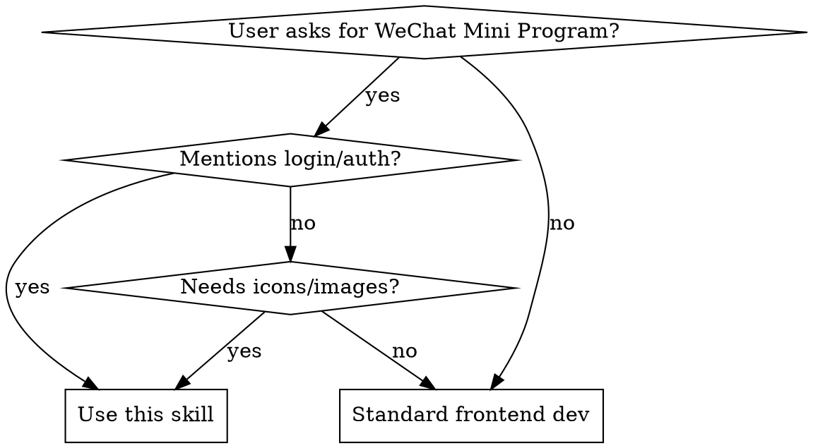

# WeChat Mini Program Development with CloudBase

## Overview
WeChat Mini Programs using CloudBase are **naturally login-free**. Get user identity via `cloud.getWXContext().OPENID` in cloud functions. Never create login pages or authorization flows.

## When to Use



**Use for WeChat Mini Program development when:**
- User asks for "登录" (login), "授权" (authorization), "session管理"
- Creating tabBar, pages, components with icon/image resources
- Configuring app.json, project.config.json
- Integrating CloudBase (database, functions, storage)
- Calling AI models in mini programs
- Getting WeChat step count data

**Do NOT use for:**
- Web frontend (React, Vue) → Use frontend-development skill
- Backend services → Use appropriate backend skill
- UI design only → Use ui-design skill

## Core Pattern: Login-Free Authentication

### ❌ WRONG - What agents naturally do
```javascript
// Don't create login pages!
pages/login/login.js
wx.getUserInfo()  // Deprecated API
wx.setStorageSync('session')  // Unnecessary
```

### ✅ CORRECT - CloudBase way
```javascript
// Cloud function
const cloud = require('wx-server-sdk');
cloud.init();

const db = cloud.database();

exports.main = async (event, context) => {
  const wxContext = cloud.getWXContext();
  const openid = wxContext.OPENID;  // Direct access to user identity

  // Use openid to fetch/create user data
  let user;
  try {
    user = await db.collection('users').doc(openid).get();
  } catch (e) {
    // User doesn't exist, create new user
    await db.collection('users').doc(openid).set({
      data: {
        createTime: new Date(),
        updateTime: new Date()
      }
    });
    user = { data: { _id: openid } };
  }

  return {
    openid,
    user,
    success: true
  };
};
```

**Frontend simply calls cloud function:**
```javascript
// mini-program/pages/profile/profile.js
Page({
  data: {
    userInfo: null,
    openid: ''
  },

  onLoad() {
    this.getUserData();
  },

  getUserData() {
    wx.cloud.callFunction({
      name: 'getUserData',
      success: res => {
        // User data already tied to openid automatically
        this.setData({
          userInfo: res.result.user.data,
          openid: res.result.openid
        });
      },
      fail: err => {
        console.error('Failed to get user data:', err);
        wx.showToast({
          title: '获取数据失败',
          icon: 'none'
        });
      }
    });
  }
});
```

## Quick Reference

| Task | Correct Approach | Common Mistake |
|------|-----------------|----------------|
| **User identity** | `cloud.getWXContext().OPENID` in cloud function | Creating login pages, auth flows |
| **Page creation** | Create 4 files: `.wxml`, `.wxss`, `.js`, `.json` | Forgetting `.json` config |
| **Icons** | Icons8 + `downloadRemoteFile` tool | Leaving paths as placeholders |
| **TabBar** | Use actual downloaded icon paths | Using non-existent local paths |
| **Environment** | Query via `envQuery` tool | Hardcoding or asking user |
| **Base library** | Set to `"latest"` in project.config.json | Using old versions |
| **AI models** | `wx.cloud.extend.AI.createModel()` (3.7.1+) | Using external APIs |
| **WeRun data** | CloudID method in cloud function | Manual session_key decryption |

## Implementation

### 1. Project Structure

```
miniprogram/              # Mini program code
├── pages/               # Page components
│   ├── index/          # Home page
│   │   ├── index.wxml  # Template
│   │   ├── index.wxss  # Styles
│   │   ├── index.js    # Logic
│   │   └── index.json  # Configuration (required!)
│   └── profile/        # Profile page
│       └── ...
├── components/          # Reusable components
├── images/             # Local images and icons
├── app.js              # App logic
├── app.json            # App configuration
├── app.wxss            # Global styles
└── project.config.json # Project configuration
cloudfunctions/         # Cloud functions
├── getUserData/        # Example cloud function
│   ├── index.js
│   └── config.json
└── ...
```

### 2. Page Creation (All 4 Files Required)

Every page MUST have all 4 files:

```bash
pages/example/
├── example.wxml   # Template (HTML-like markup)
├── example.wxss   # Styles (CSS-like)
├── example.js     # Page logic
└── example.json   # Page configuration (REQUIRED!)
```

**example.json** - Always include this file:
```json
{
  "navigationBarTitleText": "页面标题",
  "usingComponents": {}
}
```

**example.js** - Basic page structure:
```javascript
Page({
  data: {
    // Page data
    message: 'Hello'
  },

  onLoad(options) {
    // Page load - options contains URL parameters
    console.log('Page loaded with options:', options);
  },

  onReady() {
    // Page rendering complete
  },

  onShow() {
    // Page display
  },

  onHide() {
    // Page hidden
  },

  onUnload() {
    // Page unload
  },

  // Custom methods
  handleTap() {
    console.log('Tapped!');
  }
});
```

**example.wxml** - Template example:
```xml
<view class="container">
  <text>{{message}}</text>
  <button bindtap="handleTap">Click Me</button>
</view>
```

**example.wxss** - Styles example:
```css
.container {
  padding: 20rpx;
}

text {
  font-size: 32rpx;
  color: #333;
}
```

### 3. Icon Management (Critical)

**Don't leave placeholder paths!** This causes build errors.

#### Icons8 (Recommended)

**Why Icons8:**
- ✅ Very small file size (usually < 3KB)
- ✅ Supports custom colors
- ✅ Clean and professional icons
- ✅ Direct URL access

**URL Format:**
```
https://img.icons8.com/{style}/{size}/{color}/{icon-name}.png
```

**Parameters:**
- `style`: `ios` (outline style) or `ios-filled` (filled style)
- `size`: `100` (recommended 100px, file size < 5KB)
- `color`: hex color code without # (e.g., `8E8E93` for gray, `07C160` for WeChat green, `FF3B30` for red)
- `icon-name`: icon name (e.g., `home`, `user`, `settings`, `checked--v1`)

**Examples:**
```javascript
// Unselected (gray outline)
const iconUnselected = "https://img.icons8.com/ios/100/8E8E93/home.png";

// Selected (green filled)
const iconSelected = "https://img.icons8.com/ios-filled/100/07C160/home.png";

// TabBar icons
{
  "pagePath": "pages/index/index",
  "text": "首页",
  "iconPath": "images/home.png",           // Download from Icons8
  "selectedIconPath": "images/home-active.png"  // Download from Icons8
}
```

**Always download immediately:**
```javascript
// When configuring iconPath in app.json, simultaneously download:
iconPath: "images/home.png"
selectedIconPath: "images/home-active.png"

// Then use downloadRemoteFile tool to download both:
// Source: https://img.icons8.com/ios/100/8E8E93/home.png
// Target: images/home.png
// Source: https://img.icons8.com/ios-filled/100/07C160/home.png
// Target: images/home-active.png
```

**Common Icon Names:**
- Navigation: `home`, `back`, `forward`, `menu`
- User: `user`, `profile`, `settings`, `logout`
- Actions: `add`, `delete`, `edit`, `search`, `share`
- Status: `checked--v1`, `close`, `info`, `warning`

### 4. app.json Configuration

```json
{
  "pages": [
    "pages/index/index",
    "pages/profile/profile",
    "pages/product-detail/product-detail"
  ],
  "window": {
    "navigationBarTitleText": "小程序标题",
    "navigationBarBackgroundColor": "#ffffff",
    "navigationBarTextStyle": "black",
    "backgroundColor": "#f8f8f8"
  },
  "tabBar": {
    "color": "#7A7E83",
    "selectedColor": "#07C160",
    "backgroundColor": "#ffffff",
    "borderStyle": "black",
    "list": [
      {
        "pagePath": "pages/index/index",
        "text": "首页",
        "iconPath": "images/home.png",
        "selectedIconPath": "images/home-active.png"
      },
      {
        "pagePath": "pages/profile/profile",
        "text": "个人中心",
        "iconPath": "images/profile.png",
        "selectedIconPath": "images/profile-active.png"
      }
    ]
  },
  "cloud": true,
  "usingComponents": {},
  "style": "v2",
  "sitemapLocation": "sitemap.json"
}
```

### 5. project.config.json Configuration

```json
{
  "miniprogramRoot": "miniprogram/",
  "cloudfunctionRoot": "cloudfunctions/",
  "setting": {
    "urlCheck": true,
    "es6": true,
    "postcss": true,
    "minified": true
  },
  "appid": "your-app-id-here",
  "projectname": "your-project-name",
  "libVersion": "latest",
  "compileType": "miniprogram",
  "condition": {}
}
```

**Important:**
- `libVersion`: Set to `"latest"` for newest features
- `appid`: Must be configured before opening in WeChat Developer Tools

### 6. Cloud Function Examples

#### Basic Cloud Function with User Data

**cloudfunctions/getUserData/index.js:**
```javascript
const cloud = require('wx-server-sdk');
cloud.init({
  env: cloud.DYNAMIC_CURRENT_ENV
});

const db = cloud.database();
const _ = db.command;

exports.main = async (event, context) => {
  const wxContext = cloud.getWXContext();
  const { openid, appid, unionid } = wxContext;

  // Get or create user data
  try {
    const user = await db.collection('users').doc(openid).get();
    return {
      success: true,
      user: user.data,
      openid
    };
  } catch (e) {
    // User doesn't exist, create with default data
    await db.collection('users').doc(openid).set({
      data: {
        _openid: openid,
        createTime: new Date(),
        updateTime: new Date(),
        // Add default fields
        nickname: '用户',
        avatar: '/images/default-avatar.png'
      }
    });

    const newUser = await db.collection('users').doc(openid).get();
    return {
      success: true,
      user: newUser.data,
      openid
    };
  }
};
```

**cloudfunctions/getUserData/config.json:**
```json
{
  "permissions": {
    "openapi": []
  }
}
```

### 7. AI Model Invocation (Base Library 3.7.1+)

WeChat Mini Programs with base library 3.7.1+ support direct AI model calls.

```javascript
// mini-program/pages/ai/ai.js
Page({
  data: {
    userInput: '',
    aiResponse: '',
    isLoading: false
  },

  // Call AI model
  async callAI() {
    if (this.data.isLoading) return;

    this.setData({ isLoading: true });

    try {
      // Create AI model instance
      const model = wx.cloud.extend.AI.createModel("deepseek");

      // System prompt - defines AI behavior
      const systemPrompt = "你是一个有帮助的AI助手。请用简洁、友好的语气回答用户问题。";

      // User input
      const userInput = this.data.userInput || "你好";

      // Call AI with streaming response
      const res = await model.streamText({
        data: {
          model: "deepseek-chat",
          messages: [
            { role: "system", content: systemPrompt },
            { role: "user", content: userInput }
          ]
        }
      });

      // Process streaming response
      let fullResponse = '';
      for await (let str of res.textStream) {
        fullResponse += str;
        this.setData({ aiResponse: fullResponse });
      }

    } catch (err) {
      console.error('AI call failed:', err);
      wx.showToast({
        title: 'AI调用失败',
        icon: 'none'
      });
    } finally {
      this.setData({ isLoading: false });
    }
  },

  onInputChange(e) {
    this.setData({
      userInput: e.detail.value
    });
  }
});
```

**Supported AI models:**
- `deepseek` - DeepSeek AI
- `hunyuan` - Tencent Hunyuan
- Check WeChat docs for latest supported models

### 8. WeChat Step Count (WeRun Data)

**CRITICAL: Use CloudID method (base library 2.7.0+)**

#### Frontend - Get WeRun Data

```javascript
// mini-program/pages/werun/werun.js
Page({
  data: {
    steps: 0,
    todaySteps: 0
  },

  // Request WeRun permission and get data
  async getWeRunData() {
    try {
      // Get encrypted WeRun data
      const res = await wx.getWeRunData();
      const cloudID = res.cloudID;

      // Pass cloudID to cloud function
      const cloudRes = await wx.cloud.callFunction({
        name: 'decryptWeRunData',
        data: {
          weRunData: wx.cloud.CloudID(cloudID)
        }
      });

      if (cloudRes.result.success) {
        const stepInfoList = cloudRes.result.stepInfoList;

        // Get today's steps (last item)
        const todayData = stepInfoList[stepInfoList.length - 1];
        this.setData({
          steps: stepInfoList,
          todaySteps: todayData.step
        });

        wx.showToast({
          title: `今日步数: ${todayData.step}`,
          icon: 'none'
        });
      }

    } catch (err) {
      console.error('Failed to get WeRun data:', err);

      // Fallback: Use simulated data for testing
      this.setData({
        todaySteps: Math.floor(Math.random() * 10000)
      });

      wx.showToast({
        title: '使用模拟数据',
        icon: 'none'
      });
    }
  }
});
```

#### Cloud Function - Decrypt WeRun Data

**cloudfunctions/decryptWeRunData/index.js:**
```javascript
const cloud = require('wx-server-sdk');
cloud.init();

exports.main = async (event, context) => {
  const wxContext = cloud.getWXContext();

  // WeRun data is automatically decrypted by CloudBase
  const weRunData = event.weRunData;

  if (!weRunData || weRunData.errCode !== 0) {
    return {
      success: false,
      error: 'Failed to decrypt WeRun data'
    };
  }

  const stepInfoList = weRunData.data;

  return {
    success: true,
    stepInfoList: stepInfoList,
    openid: wxContext.OPENID
  };
};
```

**Important Notes:**
- ✅ Use CloudID method - secure and simple
- ❌ Never use session_key manual decryption
- ✅ Always implement fallback mechanism (simulated data)
- ✅ Handle cloudID retrieval failures gracefully

### 9. Database Operations

```javascript
// In cloud function
const db = cloud.database();

// Add document
await db.collection('todos').add({
  data: {
    description: 'Learn CloudBase',
    dueDate: new Date(),
    done: false
  }
});

// Query documents
const res = await db.collection('todos')
  .where({
    _openid: '{openid}'  // Automatically replaced with user's openid
  })
  .orderBy('createTime', 'desc')
  .limit(10)
  .get();

// Update document
await db.collection('todos').doc('todo-id').update({
  data: {
    done: true,
    updateTime: new Date()
  }
});

// Delete document
await db.collection('todos').doc('todo-id').remove();
```

### 10. Opening in WeChat Developer Tools

**Prerequisites:**
1. Check `project.config.json` has `appid` field configured
2. If missing, ask user to provide their appid

**CLI Commands:**

```bash
# macOS
/Applications/wechatwebdevtools.app/Contents/MacOS/cli open --project "/path/to/project"

# Windows
"C:\Program Files (x86)\Tencent\微信web开发者工具\cli.bat" open --project "C:\path\to\project"
```

**Project root:** Directory containing `project.config.json`

**Workflow:**
1. Verify appid exists in project.config.json
2. Use CLI to open project
3. Remind user to:
   - Perform real device preview
   - Test cloud functions
   - Check console logs
   - Upload and publish when ready

### 11. Cloud Function Deployment and Permissions

**After AI auto-deploys cloud functions:**

**Missing Permissions Issue:**
- Special permissions like cloud invocation may be missing
- WeRun decryption requires specific permissions

**Recommended Workflow:**

1. **Install Dependencies:**
   - Right-click cloud function in WeChat Developer Tools
   - Select "Upload and deploy: Cloud installation dependencies"

2. **Manual Deployment for Permissions:**
   - For functions requiring special permissions (WeRun, cloud invocation)
   - Manually deploy once via Developer Tools
   - This ensures complete permission setup

3. **Check Permissions:**
   - Right-click cloud function → "Cloud function permissions"
   - Verify "All users can call" or appropriate role
   - Check API permissions for WeRun, etc.

**Common Permission Issues:**
- Cloud function not accessible → Check "All users can call"
- WeRun decryption fails → Verify WeRun API permission
- Database operations fail → Check database permission rules

## Common Mistakes

### 1. Creating Login Pages ❌

**Symptoms:**
- "需要创建登录页面" (Need to create login page)
- "需要用户授权" (Need user authorization)
- "管理session状态" (Manage session state)
- "token刷新" (Token refresh)

**Fix:**
- STOP immediately
- Use OPENID in cloud function directly
- No login flow needed
- CloudBase handles authentication automatically

### 2. Placeholder Icon Paths ❌

**Symptoms:**
```json
{
  "iconPath": "images/home.png",  // File doesn't exist!
  "selectedIconPath": "images/home-active.png"  // Will cause build error!
}
```

**Fix:**
- Use Icons8 or actual icon resources
- Download immediately with `downloadRemoteFile`
- Verify files exist before building

### 3. Missing .json Config Files ❌

**Symptoms:**
- Created `page.wxml`, `page.wxss`, `page.js`
- Forgot `page.json`

**Fix:**
- Always create all 4 files for every page
- `page.json` is required by WeChat Mini Program framework

### 4. Forgetting to Register Pages ❌

**Symptoms:**
- Created page files
- Didn't add to `app.json` pages array
- Page won't load

**Fix:**
```json
{
  "pages": [
    "pages/index/index",
    "pages/new-page/new-page"  // Add new pages here
  ]
}
```

### 5. Using Deprecated getUserInfo ❌

**Symptoms:**
- Using `wx.getUserInfo()` or `<button open-type="getUserInfo">`
- These APIs are deprecated

**Fix:**
- Use OPENID in cloud function
- Get user info from database using openid as key

### 6. Manual Session Key Decryption ❌

**Symptoms:**
- Trying to decrypt encrypted data with session_key manually
- Complex, error-prone code

**Fix:**
- Use CloudID method
- CloudBase automatically decrypts in cloud function

## Red Flags - STOP and Reconsider

**If you're about to do any of these, STOP:**

- ❌ "创建登录页面" (Create login page)
- ❌ "用户授权登录" (User authorization login)
- ❌ "session管理" (Session management)
- ❌ "token刷新" (Token refresh)
- ❌ Using `wx.getUserInfo()`
- ❌ Icon paths that don't exist (placeholders)
- ❌ Missing .json config files
- ❌ Forgetting to register pages in app.json
- ❌ Base library version not set to "latest"
- ❌ Manual session_key decryption for WeRun data
- ❌ Hardcoding environment IDs

**All of these mean: You're approaching it wrong. Use this skill.**

## Development Workflow

### Complete Development Cycle

1. **Project Setup**
   - Create project structure (miniprogram/, cloudfunctions/)
   - Configure project.config.json with appid
   - Set libVersion to "latest"

2. **Page Development**
   - Create all 4 files for each page (.wxml, .wxss, .js, .json)
   - Register pages in app.json
   - Add icons/images using downloadRemoteFile

3. **Cloud Functions**
   - Write cloud functions with OPENID access
   - Deploy via WeChat Developer Tools
   - Configure permissions (especially for WeRun)

4. **Testing**
   - Use WeChat Developer Tools for preview
   - Test on real device
   - Check cloud function logs
   - Verify database operations

5. **Deployment**
   - Upload to WeChat
   - Submit for review
   - Publish

### Quick Checklist

Before considering work complete:

- [ ] No login pages or auth flows
- [ ] All pages have 4 files (.wxml, .wxss, .js, .json)
- [ ] All pages registered in app.json
- [ ] All icon files downloaded and exist
- [ ] Cloud functions use OPENID for user identity
- [ ] Cloud functions deployed with correct permissions
- [ ] Base library set to "latest"
- [ ] Tested in WeChat Developer Tools
- [ ] Real device preview performed
